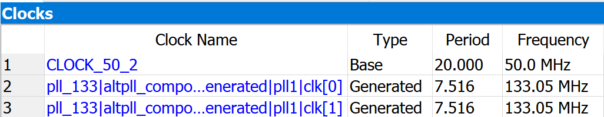

# SDRAM Controller Project

18-341: Fall Semester of 2017

## Objective and Overview

The purpose of this project is to employ your substantial skills in designing
complex interfaces to the task of writing synthesizable systems using
interesting and common interfaces.  A secondary purpose is to get you some
experience reading the data sheet for a modern component.  You will implement
a memory controller -- something a CPU might use.  Your memory controller will
exercise the SDRAM IS42S16400L chip on your DE0 FPGA board (the 68 page data
sheet is included in the repository).  You have significant freedom in
configuring the memory chip to speed up transaction times.

Using SystemVerilog, design and synthesize a memory controller to the 8MB SDRAM
chip on your DE0 FPGA board.  You won't be pushing all the corners of what the
SDRAM chip can do (for instance, no refresh), but you will exercise basic
configure/read/write capabilities and possibly some burst-mode transfers as
well.

We will give you a hardware testbench, much like we did for the Matrix Multiply
project.  This testbench will provide address/data pairs as well as a few
control signals.  The testbench is capable of providing a new
address/data/control set on each clock cycle.  Your memory controller will
execute the read or write indicated and then go back and do it again.  After
a couple of milliseconds of such activity, you'll be done.

A final objective for this project is to get you some additional experience
using SignalTap for hardware debugging.  Students who took SignalTap to heart
were much more likely to finish early in past semesters.

## Schedule and Scoring

Project value | 75 points
--- | ---
Project start | 13 Nov 2017
Project due | 4 Dec 2017 at 12:30pm
Drop dead date | 5 Dec 2017 at 12:30pm

Remember!  You must have committed something by the drop-dead date!  *You must
attempt every project*.

You will be graded on the speed with which you are able to execute all of the
read/write transactions, as well as the correctness of your implementation.
Correctness is measured by reading back the same values that you wrote at some
time in the past.  You will also be graded on code style, use of Git and demo
questions.

## A Note about Collaboration

This project is to be accomplished individually.  All work must be your own.

Hints from others can be of great help, both to the hinter and the hintee.
Thus, discussions and hints about the assignment are encouraged.  However, the
project must be coded and written up individually (you may not show, nor view,
any source code from other students).  We may use automated tools to detect
copying.

Use Piazza to ask questions or come visit us during office hours (or email for
an appointment at another time).  We want to see you succeed, but you have to
ask for help.

## Fast Things First

While we could run the memory interface at the standard 50MHz clock speed that
all your other projects have used, it would be better to push the memory chip up
to its top speed.  A quick perusal of the data sheet shows a clock cycle time of
133MHz (see page 1, under "Features").  Let's make our memory controller do
that!

You know how to change clock frequencies, right?  Clock dividers can be used to
make the clock slower, but we want to make it go faster.  Flip back through your
notes and recall that our FPGA has 4 PLLs, each of which can generate various
clock signals.  Getting one of those to go at 133MHz shouldn't be a problem.

To configure a PLL, you normally would use the MegaFunction Wizard inside
Quartus II, and fill out lots of dialog boxes and check lots of checkmarks.
Rather than step you through such a process, we've decided to give you the PLL
module to incorporate in your design.

The PLL is in zero-delay buffer mode, because this ensures it is directly
attached to the `DRAM_CLK` chip pad. The PLL that is connected to `DRAM_CLK`
happens to be connected to `CLOCK_50_2`, so we need to use that as our main
clock source.  Your design should use output `c1` for your clock.

* `inclk0`: 50MHz
* `c0`: 133MHz, -3ns phase
* `c1`: 133MHz, 0ns phase

The PLL should be instantiated as follows:

```systemverilog
clkgen clkgen_inst(
  .areset(~reset_n),
  .inclk0(CLOCK_50_2),
  .c0(DRAM_CLK),
  .c1(clock),
  .locked(pll_locked)
);
```

Now that you have another clock, the timing analyzer needs to know about it.  In
order for this to work, you need to add a timing constraint file to your
project.  For instance, make a file called `mem_ctrlr_timing.sdc` and put this
in it:

```tcl
derive_pll_clocks -create_base_clocks
derive_clock_uncertainty
```

Add this file to your project.  BTW, you might be tempted to skip this because
you might be thinking that you aren't going to run timing analysis.  (Nice try).
Quartus will use this information for parts of the flow other than timing
analysis as well, so this is critical to ensure your project works properly.

If you've done this then (after you've synthesized), the Compilation Report
-> TimeQuest Timing Analyzer -> Clocks should show three lines, like so:

```

```

Wow, that was easy!

## The SDRAM Interface

The SDRAM chip is connected to your FPGA using the signals shown in the figure
at right (taken from the DE0 User's Manual, which you've already devoured,
right?). You probably understand what the address (`A`) and data (`D`)
buses are for.  Same with write enable (`nWE`) and clock (`CLK`).  Are you
sure?  And what about all those other signals?  A quick look at the data sheet
(page 2) gives names (Clock Enable, Row Address Strobe, DQ Mask Enable, Bank
Address, etc) and longer descriptions are on page 4. You might recognize `CAS`
and `RAS` from 18-240's lecture on memories.

Skim through a bit more of the data sheet.  There are a few timing related
values that might be useful on page 8.  I'm sure glad that they "simplified" the
state diagram on page 9.  The commands on page 10 will turn out to be important.
Page 15 has a description of the initialization sequence (and while it isn't
quite tortured English, it is perhaps slightly punished).  The timing diagrams
starting on page 19 will also be important.

So, what does it all mean?  Your SDRAM is an 8MB storage device, thus holding
64Mbits (2^26).  It organizes those bytes in 4 banks, each holding 2^24 bits.
Each bank has a memory array with 2^12 rows and 2^8 columns (check out the block
diagram on page 3 of the data sheet).  Each column is a 16 bit word (thus 2^8
x 2^4 = 2^12 bits per row).  In order to access (read or write) a particular
location, the FPGA chip will have to provide a 12-bit row address, followed by
a 8-bit column address.

You might be asking yourself why the `DRAM_ADDR` signal has 13 bits in it, as
shown in the figure above, when the SDRAM chip only requires a 12-bit row
address?  I have no idea.  The DE0 schematic also shows `DRAM_ADDR[12:0]`, but
the data sheet for the chip only shows `A[11:0]`.

The row address value will be stored in the Row Address Buffer and decoded to
provide a one-hot select line for a particular row.  That row will be read into
a Row Buffer, where the column address will decode and select the particular
word to be output (for a read command) or overwritten (for a write command).
Each of the 4 banks operate in parallel, though only one performs an I/O
operation at any particular time.  Likewise, only one SDRAM command may be
issued to the chip at a time.  Bank interleaving may be used to speed up memory
accesses by pipelining I/O operations.

What do I mean by "SDRAM command?"  Well, those are the things your memory
controller will be telling the SDRAM chip.  You can tell the SDRAM to do one of:

* **READ Command**: Reads one or more bytes of data from the row buffer.

* **WRITE Command**: Writes one or more bytes of data into the row buffer.

* **PRECHARGE Command**: Precharge the column lines across all memory
  rows.  Probably more importantly for your understanding, it also writes the
  contents of the row buffer back to the memory array.

* **ACTIVATE Command**: Activates the word line of the selected row and
  transfers the contents of the memory array row to the row buffer.

* **REFRESH Command**: Refreshes rows in the memory at regular intervals to
  ensure the charge doesn't all leak away.

* Lots of other power mode related commands (many of which are part of that
  complex simplified state diagram).

How do you send a command to the chip?  Take a look at the table on page
10 of the data sheet.  You need to have **CKE** high (clock enable), various
levels on **RAS**, **CAS** and **WE** and maybe **A[10]**.  Clear?

First steps, then, will include initializing the chip.  Look again at
the initialization procedure on page 15.

1. Apply power and clock.  Make clock enable high, **DQM** high (yeah, I
   know it says DQN, sigh), and don't send an I/O command.

2. Wait for 200uS

3. **PRECHARGE** all banks (which means, ... flipping back to truth table on
   page 10 ...  chip enable (i.e. `DRAM_CS_N`) low, `RAS` and `WE` low, `CAS`
   and `A[10]` high).

4. Wait **tRP** (what is that?  It's a timing parameter.  I'll let you look
   this one up.).

5. Issue 8 auto-refresh commands.  Those are listed as CBR (Auto) refresh in the
   truth table on page 10.

6. Issue a mode register set command.  Oh, that one gets interesting.

7. Go do reads and writes.

What is that mode register set command in step 6?  Well, now we start
designing.  The mode register lets you tell the chip what options you
want, what CAS latency you want, what "wrap type" you want and what your
burst length should be.  I'm not going to tell you what those values
should be, as your design will drive them.  Start reading on page 15 of
the datasheet for specifics.

Final important point: Combinational logic on the outputs can cause timing
failures.  You want your outputs completely synchronous.  Let me say that again
for extra emphasis:

**_YOU WANT YOUR OUTPUTS COMPLETELY SYNCHRONOUS_**. This means that all signals
going to the SDRAM chip should come directly from a register output, without
exception...

## The Testbench Interface

We provide a **ChipInterfacetop.sv** file that instantiates the PLL, your
design, and our testbench.  The interface to our testbench looks like this:

```systemverilog
module HWTB (
  input logic clock, reset_n,

  output logic [21:0] addr_out,
  output logic [15:0] data_out,
  output logic we_out, re_out,

  input logic [15:0] data_in,
  input logic data_in_valid,
  input logic phase_ready,

  output logic done,
  output logic phase0_start, phase1_start, phase2_start, phase3_start,

  input logic [9:0] SW,
  output logic [3:0] LEDG,
  output logic [6:0] HEX0_D, HEX1_D, HEX2_D, HEX3_D);
```

Reads and writes are allowed on any cycle after `phaseX_start` has been
asserted. Writes are performed by asserting `phase_ready` and inspecting the new
`addr_out` and `data_out` signals.  Likewise, reads are allowed on any cycle
after `phaseX_start` was high and all the writes have finished (see phase
descriptions below for more information).  They are performed by asserting
`data_in_valid` and supplying `data_in`; the data should correspond to
`addr_out` as it was seen in-order, but this doesn't have to match the current
value.  In other words, you are allowed to bank up requests and fulfill them in
bursts if this makes your design work more efficiently. Don't worry if this
sounds confusing, we also tell your design what to do via `we_out` and `re_out`.
Basically, you advance the phase one notch during the WRITE and READ portions by
manipulating `phase_ready`, that's all you need to worry about.  Multiple read
requests can be sent before data is returned, so it is assumed that data is
returned in the order it is requested.

When `reset_n` is de-asserted and PLL is locked, your design should perform the
DRAM's initialization sequence, and then assert `phase_ready` when DRAM is fully
initialized.  Then the testbench will assert `phase0_start` for one cycle.
Similarly, subsequent phases will start only when all outstanding transactions
are done.  We recommend that you keep track of the phase you are in by counting
your own transactions, rather than relying on `phaseX_start` signals.

Your design is allowed to de-assert `phase_ready` the cycle after `phaseX_start`
if you want to do any extra initialization. For example, in phase 3 you may want
to set a new burst mode.

What are these phases, you may be wondering?  Well, we are going to start you
off easy.  Phase 0 asks your memory controller to execute a single write, then
a single read, to a simple address.  After having you perform a write and then
read from the same location, our testbench will compare the value it told you to
write with the value you provided from the read.  If they are the same, then you
pass phase 0 (and you will be rewarded with a single green LED being lit).

In Phase 1, your memory controller will be asked to do 10 writes then 10 reads,
to various spots around the address space.  Hopefully, the reads will return the
same values we asked you to write.  If so, you get another green LED.

Phase 2 asks your memory controller to perform 1000 random writes and then 1000
random reads.  When I say "random" I mean that the addresses are not sequential,
nor do they have an exploitable pattern to them.  Sorry!  Again, if your reads
return the values we told you to write, then another green LED will be lit.

Phase 3 asks your memory controller to perform 1000 sequential writes and then
1000 sequential reads.  Because they are sequential, you can optimize the
structure of where they are placed in memory, or how they are accessed in order
to speed up performance.  Again, if your reads return the values we told you to
write, then you are rewarded with the 4th green LED.  If you can successfully
demonstrate to the TA that your design uses good optimization principles, then
you will get scoring credit for this phase.

We will also be measuring the number of clock cycles it takes your memory
controller to perform these actions, values that will enable us to judge your
Phase 3 optimizations.  Those values will be sent to the 7-segment displays.

In fact, here's the scoop on what we will be sending to the 7-segment display.
`SW[1:0]` determines which phase we are interested in.  If `SW[9]` is one, then
we output the number of correct reads in the phase. Otherwise, we output the
number of clock periods it took to complete the phase.  Our counter is 32-bits,
so we use `SW[8]` to control the output: top 16-bits when it is a one, and lower
16-bits when a zero.

## Simulation

We don't have a simulation model of the memory device.  Therefore, you're going
to have to do simple simulations (perhaps to ensure you are getting address/data
information properly from our testbench).  Other debugging can be done with
SignalTap on the chip.

Oh, and we really, really, really suggest using SignalTap on the chip.
SignalTap is pretty easy to use, and will significantly cut down your debug
time.  Spend 15 minutes learning to use it — you will easily make up that time
with quicker debug cycles for this project.


## For You

In the repo, you will find the following files:

* **ChipInterface.sv** -- This file is the one shown above. Copy it to your
  working directory.  You shouldn't need to modify it.

* **MemCtrlr.sv** -- Your design goes here.

* **clkgen.v** -- This is an automatically created file for the PLL clock
  generator.

* **mem_ctrlr.mif** -- The blockRAM initialization file for phase 2.

* **MemCtrlrPkg.pkg** -- A package containing a useful structure.

* **HWTB.sv** -- The hardware testbench; feel free to look around.

* **docs/IS42S16400.pdf** -- the datasheet for the SDRAM chip.

* **docs/4_improved_power_modeling_of_ddr_sdrams.pdf** -- This is a paper about
  power systems in SDRAMs.  I'm giving it to you because it has a good overview
  of how DRAMs work and some good figures (timing diagrams).

* **README.md** -- This file.

* **output_files/.keep** -- A placeholder file to make sure Git uses this
  directory.

Make sure to place your bitstream file (output_files/*.sof) under git control
and commit it with your final commit.

## For Credit

Turn your SystemVerilog modules “appropriately” written. e.g., clean writing
style and correct use of SV language semantics.  You will also turn in your
bitstream file.

Given the above files, we will do the following:

* Configure the board with your bitstream file.  We will check the LEDs to
  determine which phases ran correctly.  We will examine the clock cycle
  counters on the 7-segment displays.

* If not done, we will dig through your SV code to try to give you some
  partial credit.

* Ask you some questions. Come early and prepared to start.

If you can’t get all of this to work, please note from the grading sheet at the
end of this document that we’ll give partial credit for seeing certain parts of
this working. Making sure that your partial solution shows evidence of these
parts working as this will help us give you partial credit for what you did.

## Demos and Lateness

Same as in previous projects, you will demo outside of class times on or near
the due date.

**Grace Day**:  You may use your grace day to turn in the solution up to 24
hours late.  If you do not intend to use a grace day (or have already used
yours), make sure you have *something* committed and pushed at the deadline to
avoid getting a zero on this project.
